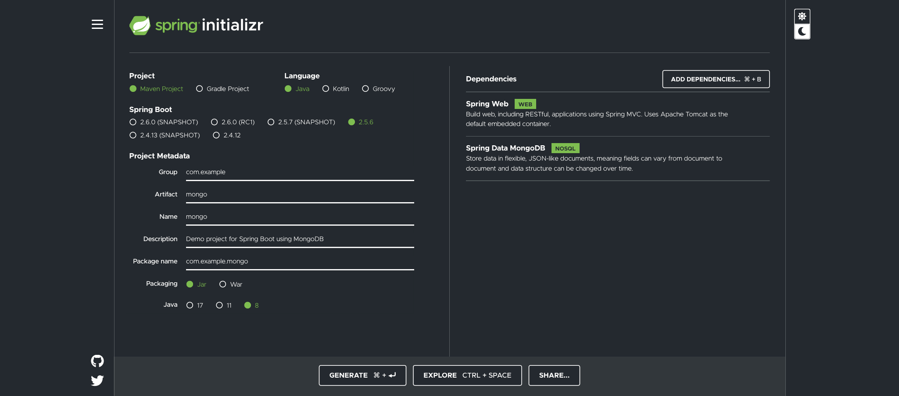

# Lesson 2: CRUD API with Mongo

## Project Setup
First you will need to have some programs installed on your computer in order to build an app like this. 

* [IntelliJ](https://www.jetbrains.com/idea/)
* [Mongo](https://www.mongodb.com/try/download/community)

## Project Initializer
Go to the [Spring Boot initializer](https://start.spring.io/) to bootstrap your project. Below are the options you should select:



Generate this project and open with your IDE.

## Mongo Configuration
Go to the <code>application.properties</code> file and insert your Mongo configs:

```aidl
// these will be specific to your needs
spring.data.mongodb.host=host
spring.data.mongodb.port=1234
spring.data.mongodb.username=username
spring.data.mongodb.password=password
spring.data.mongodb.database=database

// you can alternatively choose to do this with a uri
spring.data.mongodb.uri=mongodb://localhost:270170/projectname
```

You can go to your Mongo account and select <code>Connect</code> to get the details for your uri. You can choose to include this in your .gitignore to hide any private data

## Model Package: Database layer
### Create the model
Create a model package and make a class called <code>Expenses</code> where we will make the model used by the database. Inside this class you can have the following code:

```aidl
package com.example.mongo.model;

import org.springframework.data.annotation.Id;
import org.springframework.data.mongodb.core.index.Indexed;
import org.springframework.data.mongodb.core.mapping.Document;
import org.springframework.data.mongodb.core.mapping.Field;

import java.math.BigDecimal;

@Document("expenses")
public class Expenses {

    @Id
    private String id;
    @Field(name="name")
    @Indexed(unique = true)
    private String expenseName;
    @Field(name="category")
    private ExpenseCategory expenseCategory;
    @Field(name="amount")
    private BigDecimal expenseAmount;

    public Expenses(String id, String expenseName, ExpenseCategory expenseCategory, BigDecimal expenseAmount) {
        this.id = id;
        this.expenseName = expenseName;
        this.expenseCategory = expenseCategory;
        this.expenseAmount = expenseAmount;
    }

    public String getId() {
        return id;
    }

    public String getExpenseName() {
        return expenseName;
    }

    public ExpenseCategory getExpenseCategory() {
        return expenseCategory;
    }

    public BigDecimal getExpenseAmount() {
        return expenseAmount;
    }

    public void setId(String id) {
        this.id = id;
    }

    public void setExpenseName(String expenseName) {
        this.expenseName = expenseName;
    }

    public void setExpenseCategory(ExpenseCategory expenseCategory) {
        this.expenseCategory = expenseCategory;
    }

    public void setExpenseAmount(BigDecimal expenseAmount) {
        this.expenseAmount = expenseAmount;
    }
}

```
You can automatically add the constructor and getters, setters using the <code>control + enter</code> key command then select the parameters in the popup modal.

The <code>@Document</code> annotation will help Mongo know what to call this collection and the documents inside of it.

The <code>@Id</code> annotation denotes an ID field. If you want to customize the field name then you can use the <code>@Field</code> annotation. Finally, you can index a field by using the <code>@Indexed</code> annotation.

### Custom Queries
If you want to include any custom queries that go beyond the scope of what Mongo offers through its dependency then you can make an interface like this:

```aidl
package com.example.mongo.repository;

import com.example.mongo.model.Expenses;
import org.springframework.data.mongodb.repository.MongoRepository;
import org.springframework.data.mongodb.repository.Query;

import java.util.Optional;

public interface ExpenseRepository extends MongoRepository<Expenses, String> {

    @Query("{'name':?0}")
    Optional<Expenses> findByName(String name);

}
```

The <code>@Query</code> annotation denotes a custom query that can be used.

## Service Package: Business Logic
### Service File
Create a class called <code>ExpenseServices</code> for your business logic. 

```aidl
package com.example.mongo.services;

import com.example.mongo.model.Expenses;
import com.example.mongo.repository.ExpenseRepository;
import org.springframework.stereotype.Service;

import java.util.List;

@Service
public class ExpenseServices {

    private final ExpenseRepository expenseRepository;

    public ExpenseServices(ExpenseRepository expenseRepository) {
        this.expenseRepository = expenseRepository;
    }

    public void addExpense(Expenses expense){
        expenseRepository.insert(expense);
    }

    public void updateExpense(Expenses expenses){
        Expenses savedExpense = expenseRepository.findById(expenses.getId())
                .orElseThrow(() -> new RuntimeException(
                        String.format("Cannot Find Expense by ID %s",expenses.getId())
                ));

        savedExpense.setExpenseName(expenses.getExpenseName());
        savedExpense.setExpenseCategory(expenses.getExpenseCategory());
        savedExpense.setExpenseAmount(expenses.getExpenseAmount());
        expenseRepository.save(expenses);
    }

    public List<Expenses> getAllExpenses(){
        return expenseRepository.findAll();
    }

    public Expenses getExpenseByName(String name){
        return expenseRepository.findByName(name)
                .orElseThrow(()-> new RuntimeException(
                        String.format("Cannot find expense by name %s",name)
                ));
    }

    public void deleteExpense(String id){
        expenseRepository.deleteById(id);
    }
}
```
This is the code that tells what should happen between the request and response cycle.

## API Package: Controller Layer
### Controller File
Create a class called <code>ExpenseController</code> which will be used for any REST operation.

```aidl
package com.example.mongo.controller;

import com.example.mongo.model.Expenses;
import com.example.mongo.services.ExpenseServices;
import org.springframework.http.HttpStatus;
import org.springframework.http.ResponseEntity;
import org.springframework.web.bind.annotation.*;

import java.util.List;

@RestController
@RequestMapping("/api/expense")
public class ExpenseController {

    private final ExpenseServices expenseServices;

    public ExpenseController(ExpenseServices expenseServices) {
        this.expenseServices = expenseServices;
    }

    @PostMapping
    public ResponseEntity<Expenses> addExpense(@RequestBody Expenses expenses){
        expenseServices.addExpense(expenses);
        return ResponseEntity.status(HttpStatus.CREATED).build();
    }

    @PutMapping
    public ResponseEntity<Expenses> updateExpense(@RequestBody Expenses expenses){
        expenseServices.updateExpense(expenses);
        return ResponseEntity.ok().build();
    }

    @GetMapping
    public ResponseEntity<List<Expenses>> getAllExpenses(){
        return ResponseEntity.ok(expenseServices.getAllExpenses());
    }

    @GetMapping("/{name}")
    public ResponseEntity<Expenses> getExpenseByName(@PathVariable String name){
        return ResponseEntity.ok(expenseServices.getExpenseByName(name));
    }

    @DeleteMapping("/{id}")
    public ResponseEntity<Expenses> deleteExpense(@PathVariable String id){
        expenseServices.deleteExpense(id);
        return ResponseEntity.status(HttpStatus.NO_CONTENT).build();
    }
}
```

## Test the API
### Postman
Open Postman and make an endpoint for all the applicable routes. Start the server on port 8080 and send a request from Postman via all the routes. Check to make sure that all routes are behaving properly without any error. 

## Additional Resources
### Reference Documentation
For further reference, please consider the following sections:

* [Official Apache Maven documentation](https://maven.apache.org/guides/index.html)
* [Spring Boot Maven Plugin Reference Guide](https://docs.spring.io/spring-boot/docs/2.5.6/maven-plugin/reference/html/)
* [Create an OCI image](https://docs.spring.io/spring-boot/docs/2.5.6/maven-plugin/reference/html/#build-image)
* [Spring Web](https://docs.spring.io/spring-boot/docs/2.5.6/reference/htmlsingle/#boot-features-developing-web-applications)
* [Spring Data MongoDB](https://docs.spring.io/spring-boot/docs/2.5.6/reference/htmlsingle/#boot-features-mongodb)

### Guides
The following guides illustrate how to use some features concretely:

* [Building a RESTful Web Service](https://spring.io/guides/gs/rest-service/)
* [Serving Web Content with Spring MVC](https://spring.io/guides/gs/serving-web-content/)
* [Building REST services with Spring](https://spring.io/guides/tutorials/bookmarks/)
* [Accessing Data with MongoDB](https://spring.io/guides/gs/accessing-data-mongodb/)

