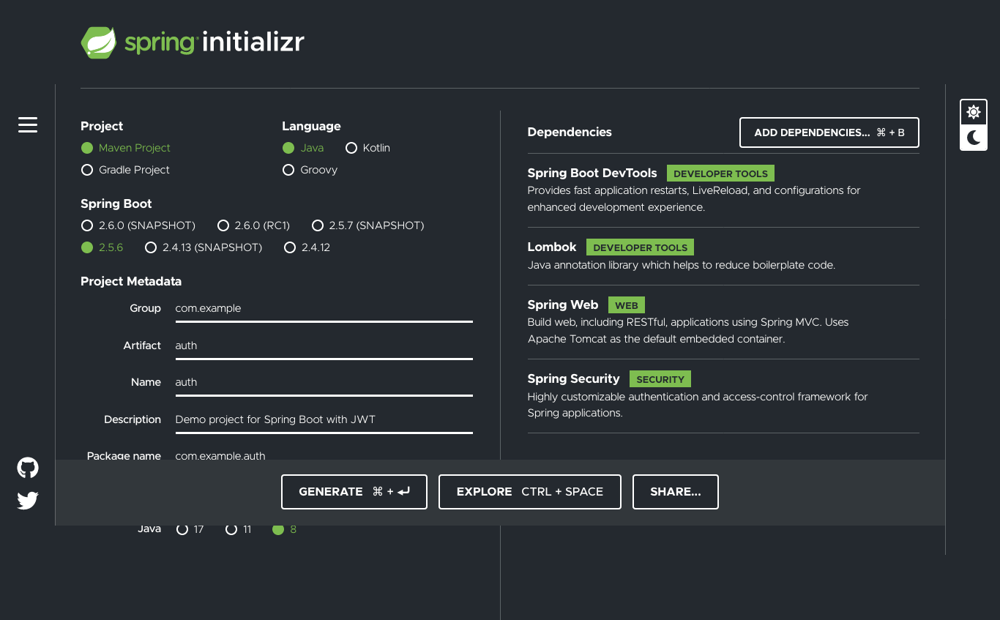

# Lesson 3: CRUD API with PostGreSQL

## Project Setup
You will need to have some programs installed on your local computer to continue with this lesson:

<ul>
<li><a href="https://www.jetbrains.com/idea/">IntelliJ</a></li>
<li><a href="https://www.postgresql.org/download/">PostgreSQL</a></li>
</ul>

## Project Initializer
Go to [Spring Boot Initializer](https://start.spring.io/) to bootstrap your project. Below are the options you can select:



Generate this project and open it with your IDE.

## Postgres Configuration
Go to the <code>application.properties</code> file and add these configuration settings:
```aidl
spring.datasource.url=jdbc:postgresql://localhost:5432/springboot
spring.datasource.username=davidking
spring.datasource.password=auth_string

spring.jpa.hibernate.ddl-auto=create-drop
spring.jpa.hibernate.show-sql=true
spring.jpa.properties.hibernate.dialect = org.hibernate.dialect.PostgreSQLDialect
spring.jpa.properties.hibernate.format_sql=true

server.error.include-message=always
```
You can add this file to your .gitignore file for privacy reasons. 

In order to use Postgres then you will need to run the server through its application. Press <code>Start</code> to begin running the server. Configuration can be found on the installation website.

## Database Layer
### Model Package
Within the <code>model package</code>, create a class named <code>Student</code> which will act as your model for the database.

```aidl
package com.example.postgres.model;


import javax.persistence.*;
import java.time.LocalDate;
import java.time.Period;

@Entity
@Table
public class Student {

    @Id
    @SequenceGenerator(
            name = "student_sequence",
            sequenceName = "student_sequence",
            allocationSize = 1
    )
    @GeneratedValue(
            strategy = GenerationType.SEQUENCE,
            generator = "student_sequence"
    )
    private Long id;
    private String name;
    private String email;
    private LocalDate dob;
    @Transient
    private Integer age;

    public Student(){}

    public Student(Long id, String name, String email, LocalDate dob) {
        this.id = id;
        this.name = name;
        this.email = email;
        this.dob = dob;
    }

    public Long getId() {
        return id;
    }

    public void setId(Long id) {
        this.id = id;
    }

    public String getName() {
        return name;
    }

    public void setName(String name) {
        this.name = name;
    }

    public String getEmail() {
        return email;
    }

    public void setEmail(String email) {
        this.email = email;
    }

    public LocalDate getDob() {
        return dob;
    }

    public void setDob(LocalDate dob) {
        this.dob = dob;
    }

    public Integer getAge() {
        return Period.between(this.dob,LocalDate.now()).getYears();
    }

    public void setAge(Integer age) {
        this.age = age;
    }

    @Override
    public String toString() {
        return "Student{" +
                "id=" + id +
                ", name='" + name + '\'' +
                ", email='" + email + '\'' +
                ", dob=" + dob +
                ", age=" + age +
                '}';
    }
}

```
After identifying the fields that will be present in your table then you can go on to create a constructor along with the getters and setters.

There are a few annotations worth mentioning:
<ul>
<li>The <b>@Entity</b> annotation specifies that the class is an entity and is mapped to a database table. The <b>@Table</b> annotation specifies the name of the database table to be used for mapping.</li><br>
<li>The <b>@Table</b> annotation specifies the name of the database table to be used for mapping. The <b>@Id</b> annotation specifies the primary key of an entity and the <b>@GeneratedValue</b> provides for the specification of generation strategies for the values of primary keys.</li><br>
<li>The <b>@Id</b> annotation specifies the primary key of an entity and the <b>@GeneratedValue</b> provides for the specification of generation strategies for the values of primary keys.</li><br>
<li>It is the name of the primary key generator as specified in the <b>@SequenceGenerator</b> or <b>@TableGenerator</b> annotation. These two annotations controls how database sequence or table is mapped. <b>@SequenceGenerator</b> and <b>@TableGenerator</b> can be used on the entity class or on the primary key field or property.</li><br>
<li>The <b>@GeneratedValue</b> annotation is to configure the way of increment of the specified column(field). For example when using Mysql , you may specify auto_increment in the definition of table to make it self-incremental, and then use <b>@GeneratedValue</b>(strategy = GenerationType.IDENTITY)</li><br>
</ul>

### Repository Package
<hr></hr>

### Repository
Within the <code>repository package</code>, you can put custom queries inside of an interface called <code>StudentRepository</code>. Below shows one custom query:
```aidl
package com.example.postgres.repository;

import com.example.postgres.model.Student;
import org.springframework.data.jpa.repository.JpaRepository;
import org.springframework.data.jpa.repository.Query;
import org.springframework.stereotype.Repository;

import java.util.Optional;

@Repository
public interface StudentRepository extends JpaRepository<Student,Long> {

    @Query("SELECT s FROM Student s WHERE s.email = ?1")
    Optional<Student> findStudentByEmail(String email);
}
```
The Spring Boot JPA comes with built in queries that are premade. This repository class is only for those queries that go outside that scope.

Within this interface there are some important annotations worth mentioning:
<ul>
<li>The <b>@Query</b> annotation defines queries directly on repository methods. This gives you full flexibility to run any query without following the method naming conventions. Let us get started with the creation of a sample Spring Data JPA application.</li>
</ul>

From this screenshot you can see SQL was added, but other ways of defining the details of the query are also allowed. It is your preference as to what method you choose to use.

<hr></hr>

### Configuration

Also within the repository package you can add seed inputs for the database. Create a class called <code>StudentConfiguration</code> to put in any such seeding:

```aidl
package com.example.postgres.repository;

import com.example.postgres.model.Student;
import org.springframework.boot.CommandLineRunner;
import org.springframework.context.annotation.Bean;
import org.springframework.context.annotation.Configuration;

import java.time.LocalDate;
import java.util.ArrayList;
import java.util.List;

@Configuration
public class StudentConfiguration {

    @Bean
    CommandLineRunner commandLineRunner(StudentRepository repository) {
        return args -> {
          Student student1 = new Student(
                  1L,
                  "Jack",
                  "jack@example.com",
                  LocalDate.of(2000,1,1)
          );
          Student student2 = new Student(
                  2L,
                  "Jill",
                  "jill@example.com",
                  LocalDate.of(1990,1,1)
          );
          List<Student> studentList = new ArrayList<>();
          studentList.add(0,student1);
          studentList.add(1,student2);
          repository.saveAll(studentList);
        };
    }
}

```

Within this class there are some important annotations worth mentioning:
<ul>
<li><b>@Configuration</b> annotation indicates that a class declares one or more <b>@Bean</b> methods and may be processed by the Spring container to generate bean definitions and service requests for those beans at runtime.</li><br>
<li>Spring <b>@Bean</b> annotation tells that a method produces a bean to be managed by the Spring container. It is a method-level annotation. During Java configuration ( <b>@Configuration</b> ), the method is executed and its return value is registered as a bean within a BeanFactory .</li>
</ul>

## Business Logic Layer
### Service Package
Within the <code>service package</code>, create a class which will serve as the business logic:
```aidl
package com.example.postgres.services;

import com.example.postgres.model.Student;
import com.example.postgres.repository.StudentRepository;
import org.springframework.beans.factory.annotation.Autowired;
import org.springframework.stereotype.Service;

import javax.transaction.Transactional;
import java.util.List;
import java.util.Objects;
import java.util.Optional;

@Service
public class StudentService {

    private final StudentRepository studentRepository;

    @Autowired
    public StudentService(StudentRepository studentRepository) {
        this.studentRepository = studentRepository;
    }

    public List<Student> getStudents() {
        return studentRepository.findAll();
    }

    public void addNewStudent(Student student) {
        Optional<Student> studentByEmail = studentRepository.findStudentByEmail(student.getEmail());
        if(studentByEmail.isPresent()){
            throw new IllegalStateException("email already taken");
        }
        studentRepository.save(student);
    }

    public void deleteStudent(Long studentId) {
        boolean studentExists = studentRepository.existsById(studentId);
        if(!studentExists){
            throw new IllegalStateException("student does not exists");
        }
        studentRepository.deleteById(studentId);
    }

    @Transactional
    public void updateStudent(Long studentId, String name, String email) {
        Student student = studentRepository.findById(studentId)
                .orElseThrow(()-> new IllegalStateException(
                        "student does not exists"
                ));

        if (name != null && name.length() > 0 && !Objects.equals(student.getName(),name)){
            student.setName(name);
        }

        if (email != null && email.length() > 0 && !Objects.equals(student.getName(),email)) {
            Optional<Student> studentOptional = studentRepository.findStudentByEmail(email);
            if (studentOptional.isPresent()) {
                throw new IllegalStateException("email taken");
            }
            student.setEmail(email);
        }
    }
}
```
There are a few annotations worth mentioning:
<ul>
<li>Spring <b>@Service</b> annotation is used with classes that provide some business functionalities. Spring context will autodetect these classes when annotation-based configuration and classpath scanning is used.</li><br>
<li>In the spring boot, the <b>@Autowired</b> annotation is used in setter methods to inject the value of the class properties. When the bean is loaded in the ApplicationContext, the setter method is automatically called by the spring boot and the value is assigned.</li><br>
<li>The <b>@Transactional</b> annotation is the metadata that specifies the semantics of the transactions on a method. We have two ways to rollback a transaction: declarative and programmatic. In the declarative approach, we annotate the methods with the @Transactional annotation.</li>
</ul>

## API Layer
### Controller Package
Within the <code>controller package</code>, create a class called <code>StudentController</code> which will take in requests from the client and work with the business logic to carry out the request.
```aidl
package com.example.postgres.controller;

import com.example.postgres.model.Student;
import com.example.postgres.services.StudentService;
import org.springframework.beans.factory.annotation.Autowired;
import org.springframework.web.bind.annotation.*;

import java.util.List;

@RestController
@RequestMapping(path="/api/v1/student")
public class StudentController {

    private final StudentService studentService;

    @Autowired
    public StudentController(StudentService studentService) {
        this.studentService = studentService;
    }

    @GetMapping
    public List<Student> getStudents() {
        return studentService.getStudents();
    }

    @PostMapping
    public void registerNewStudent(@RequestBody Student student) {
        studentService.addNewStudent(student);
    }

    @DeleteMapping(path = "{studentId}")
    public void deleteStudent(@PathVariable("studentId") Long studentId ){
        studentService.deleteStudent(studentId);
    }

    @PutMapping(path = "{studentId}")
    public void updateStudent(
            @PathVariable("studentId") Long studentId,
            @RequestParam(required = false) String name,
            @RequestParam(required = false) String email
    ) {
        studentService.updateStudent(studentId, name, email);
    }

}
```
There are a few annotations worth mentioning here:
<ul>
<li>Spring RestController annotation is a convenience annotation that is itself annotated with @Controller and @ResponseBody . This annotation is applied to a class to mark it as a request handler. Spring RestController annotation is used to create RESTful web services using Spring MVC</li><br>
<li>@RequestMapping is the most common and widely used annotation in Spring MVC. It is used to map web requests onto specific handler classes and/or handler methods. @RequestMapping can be applied to the controller class as well as methods. It has the following optional options. name: Assign a name to this mapping.</li><br>
<li>The @GetMapping annotation is a specialized version of @RequestMapping annotation that acts as a shortcut for @RequestMapping(method = RequestMethod. GET) . The @GetMapping annotated methods in the @Controller annotated classes handle the HTTP GET requests matched with given URI expression.</li><br>
<li>Annotation for mapping HTTP POST requests onto specific handler methods. Specifically, @PostMapping is a composed annotation that acts as a shortcut for @RequestMapping(method = RequestMethod. POST)</li><br>
<li>As we know PUT HTTP method is used to update/modify the resource so @PutMapping annotation is used for mapping HTTP PUT requests onto specific handler methods. Specifically, @PutMapping is a composed annotation that acts as a shortcut for @RequestMapping(method = RequestMethod. PUT).</li><br>
<li>@DeleteMapping annotation for mapping HTTP DELETE requests onto specific handler methods. Specifically, @DeleteMapping is a composed annotation that acts as a shortcut for @RequestMapping(method = RequestMethod. DELETE)</li><br>
<li>Simply put, the @RequestBody annotation maps the HttpRequest body to a transfer or domain object, enabling automatic deserialization of the inbound HttpRequest body onto a Java object.</li><br>
<li>@PathVariable is a Spring annotation which indicates that a method parameter should be bound to a URI template variable. If the method parameter is Map then the map is populated with all path variable names and values. ... required - tells whether the path variable is required. value - alias for name.</li><br>
<li>@PathParam is a parameter annotation which allows you to map variable URI path fragments into your method call. @PathVariable is to obtain some placeholder from the URI (Spring call it an URI Template)</li>
</ul>

## Run API
### Server
Start the backend server by using the IDE specific <code>run</code> functionality. Once the server is up an running then you can move forward with endpoint checking.
### Postman
Postman is a client application that will mimic calls from a front end request. You can use any client application you prefer. Check each endpoint, method and action within your api. After ensuring that there are no errors then you can move forward using this api.
### More...
If you want to add more complexity to this api then follow the same format from the database layer all the way to the api layer.

## Additional Resources
### Reference Documentation
For further reference, please consider the following sections:

* [Official Apache Maven documentation](https://maven.apache.org/guides/index.html)
* [Spring Boot Maven Plugin Reference Guide](https://docs.spring.io/spring-boot/docs/2.5.6/maven-plugin/reference/html/)
* [Create an OCI image](https://docs.spring.io/spring-boot/docs/2.5.6/maven-plugin/reference/html/#build-image)
* [Spring Web](https://docs.spring.io/spring-boot/docs/2.5.6/reference/htmlsingle/#boot-features-developing-web-applications)
* [Spring Data JPA](https://docs.spring.io/spring-boot/docs/2.5.6/reference/htmlsingle/#boot-features-jpa-and-spring-data)

### Guides
The following guides illustrate how to use some features concretely:

* [Building a RESTful Web Service](https://spring.io/guides/gs/rest-service/)
* [Serving Web Content with Spring MVC](https://spring.io/guides/gs/serving-web-content/)
* [Building REST services with Spring](https://spring.io/guides/tutorials/bookmarks/)
* [Accessing Data with JPA](https://spring.io/guides/gs/accessing-data-jpa/)

